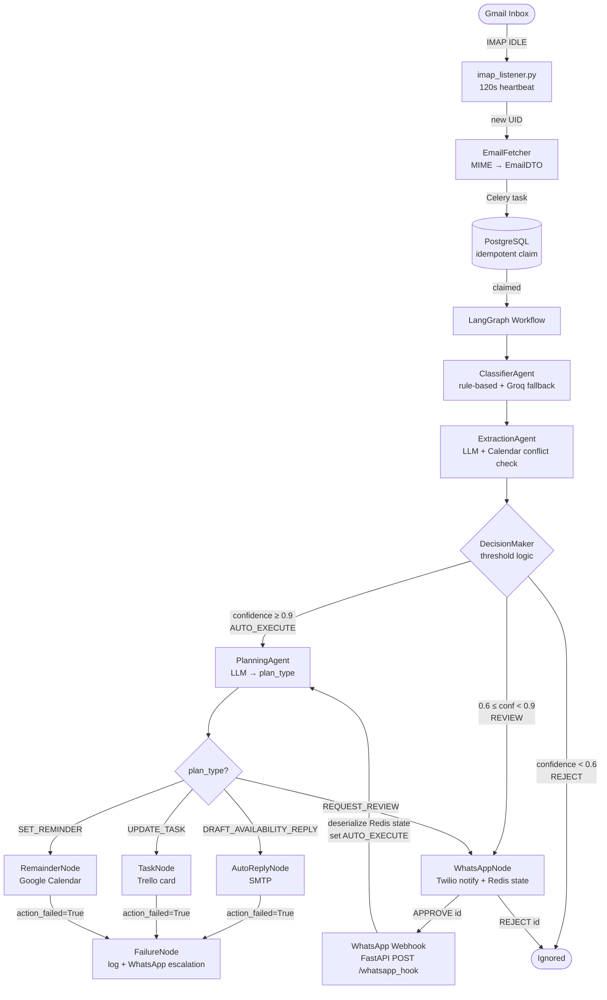
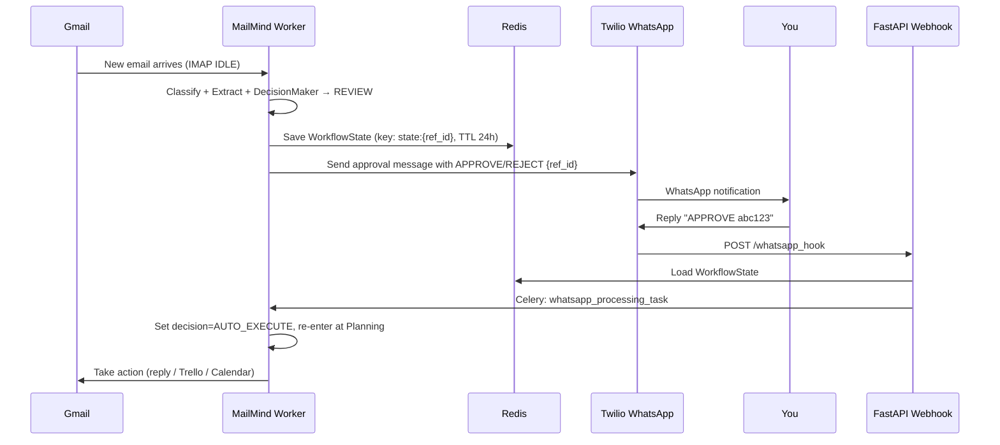
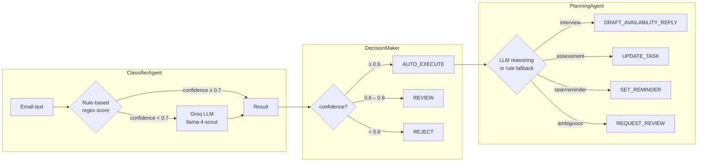
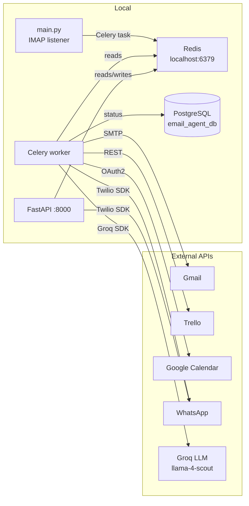

<div align="center">

# MailMind

**Autonomous Email AI Agent**

*Monitors → Classifies → Acts — with human-in-the-loop approval over WhatsApp*

[](https://python.org)
[](https://langchain-ai.github.io/langgraph/)
[](https://groq.com)
[](https://docs.celeryq.dev)
[](https://fastapi.tiangolo.com)

</div>

---

## What It Does

MailMind is a daemon that sits behind your Gmail inbox and acts on every new email automatically:

| Email Type | MailMind Action |
|---|---|
| Interview invite | Checks calendar for conflicts → drafts availability reply |
| Assessment / task | Creates a Trello card with deadline |
| Reminder-type email | Sets a Google Calendar event |
| Low-confidence / ambiguous | Sends you a WhatsApp approval request |
| Anything else | Ignores it |

Everything above a **0.9 confidence** threshold happens without you touching anything. Between **0.6 – 0.9** you get a WhatsApp ping. Below **0.6** it's silently rejected.

---

## Pipeline Overview



---

## Human-in-the-Loop Flow



---

## Classification & Decision Logic



---

## Quick Start

### Prerequisites

- Python 3.11+
- PostgreSQL — database `email_agent_db`
- Redis — `localhost:6379`
- Google OAuth2 `token.json` with `calendar.events` scope (pre-generate via OAuth2 flow)

### 1. Install dependencies

```bash
pip install pydantic pydantic-settings langchain-groq langchain-core langgraph \
            celery redis imapclient google-auth google-auth-oauthlib \
            google-auth-httplib2 google-api-python-client \
            twilio requests psycopg2-binary fastapi uvicorn
```

### 2. Create the database table

```sql
CREATE TABLE email_agent_table (
    msgid      VARCHAR PRIMARY KEY,
    status     VARCHAR,
    updated_at TIMESTAMP
);
```

### 3. Configure `.env`

```env
# ── Email ──────────────────────────────────────────
EMAIL_USER_NAME=you@gmail.com
EMAIL_PASSWORD=your_app_password       # Gmail App Password, not your login password
IMAP_SERVER=imap.gmail.com

# ── LLM (Groq) ─────────────────────────────────────
GROQ_API_KEY=gsk_...

# ── WhatsApp via Twilio ─────────────────────────────
TWILIO_ACCOUNT_SID=AC...
TWILIO_AUTH_TOKEN=...
TWILIO_PHONE_NUMBER=+14155238886
TARGET_PHONE_NUMBER=+91...             # your WhatsApp number

# ── Trello ─────────────────────────────────────────
TRELLO_API_KEY=...
TRELLO_API_TOKEN=ATTA...
TRELLO_LIST_ID=...                     # target list ID for new cards

# ── Google Calendar ─────────────────────────────────
TOKEN_PATH=token.json                  # path to your OAuth2 token

# ── PostgreSQL ──────────────────────────────────────
DB_HOST=localhost
DB_NAME=email_agent_db
DB_USER=postgres
DB_PASSWORD=...

# ── Celery / Redis ──────────────────────────────────
CELERY_BROKER_URL=redis://localhost:6379/1

# ── Decision thresholds ─────────────────────────────
AUTO_EXECUTE_THRESHOLD=0.9
REVIEW_THRESHOLD=0.6
```

### 4. Run all three processes

Open three terminals:

```bash
# Terminal 1 — IMAP listener daemon
python main.py

# Terminal 2 — Celery async worker
celery -A core.task_scheduler worker --loglevel=info

# Terminal 3 — FastAPI webhook (WhatsApp approvals)
uvicorn core.task_scheduler:app --host 0.0.0.0 --port 8000
```

---

## Architecture

### LangGraph State (`workflow/state.py`)

`WorkflowState` is the single TypedDict that flows through every node:

```
WorkflowState
├── email          EmailDTO          raw parsed email
├── classification ClassificationResult  category, priority, confidence
├── extraction     ExtractionResult      meeting_at, deadline, company, role, suggested_reply
├── decision       DecisionType          AUTO_EXECUTE | REVIEW | REJECT
├── plan_type      PlanningEvent         which action to take
├── event_type     str                   EMAIL | APPROVED
├── action_failed  bool                  set by action nodes on error
└── execution_result str                 human-readable outcome
```

### Node Reference

| Node | Module | Type | Responsibility |
|---|---|---|---|
| `ClassifierAgent` | `nodes/classifer_agent.py` | LLM (Groq) | Hybrid regex + LLM classification; lazy LLM init |
| `ExtractionAgent` | `nodes/extraction_agent.py` | LLM (Groq) | Structured extraction + Google Calendar conflict check |
| `DecisionMakerNode` | `nodes/decision_maker_node.py` | Rule-based | Confidence thresholds → decision enum |
| `PlanningNode` | `nodes/planning_node.py` | LLM (Groq) | LLM plan selection with rule-based fallback |
| `AutoReplyNode` | `nodes/auto_reply_node.py` | Stateless | SMTP reply via `tools/mail_tool.py` |
| `TaskNode` | `nodes/task_node.py` | Stateless | Trello card creation; duplicate + 5/day guard |
| `RemainderNode` | `nodes/remainder_node.py` | Stateless | Google Calendar event via `tools/calendar_tool.py` |
| `WhatsAppNode` | `nodes/whatsapp_node.py` | Stateless | Twilio message + Redis state serialization (24h TTL) |
| `FailureNode` | `nodes/failure_node.py` | Stateless | Log failure + escalate via WhatsAppNode |

### Tools

| Tool | File | Wraps |
|---|---|---|
| Calendar | `tools/calendar_tool.py` | Google Calendar API — conflict check + event creation |
| Trello | `tools/trello_tool.py` | Trello REST API — list cards + create card |
| Mail | `tools/mail_tool.py` | Gmail SMTP — send reply |

### Enums

```python
class DataClassifier(str, Enum):
    assessment     = "assessment"
    interview      = "interview"
    task           = "task"
    not_classified = "not_classified"

class DecisionType(str, Enum):
    AUTO_EXECUTE = "AUTO_EXECUTE"
    REVIEW       = "REVIEW"
    REJECT       = "REJECT"

class PlanningEvent(str, Enum):
    DRAFT_AVAILABILITY_REPLY = "DRAFT_AVAILABILITY_REPLY"
    UPDATE_TASK              = "UPDATE_TASK"
    SET_REMINDER             = "SET_REMINDER"
    REQUEST_REVIEW           = "REQUEST_REVIEW"
    IGNORE                   = "IGNORE"
```

---

## WhatsApp Message Formats

`WhatsAppNode` sends category-aware approval messages:

<details>
<summary><strong>INTERVIEW</strong></summary>

```
🔔 *Interview Approval Required*
📩 From: {sender}
📌 Subject: {subject}
🏢 Company: {company}
🎯 Role: {role}
📅 Meeting: {meeting_time}
🌍 Timezone: {timezone}
🚦 Priority: {priority}
🔁 Alternate Time: {alternate_time}   ← only if calendar conflict
```
</details>

<details>
<summary><strong>ASSESSMENT</strong></summary>

```
🔔 *Assessment Review Required*
📩 From: {sender}
📌 Subject: {subject}
🏢 Company: {company}
📋 Task: {role}
⏰ Deadline: {deadline}
📏 Estimated Time: {time_estimate}
🚦 Priority: {priority}
```
</details>

<details>
<summary><strong>TASK</strong></summary>

```
🔔 *Task Review Required*
📩 From: {sender}
📌 Subject: {subject}
🏢 Company: {company}
✓ Task: {role}
⏳ Due: {deadline}
🔗 Dependencies: {dependencies}
🚦 Priority: {priority}
```
</details>

Reply to approve or reject:

```
APPROVE abc123
REJECT  abc123
```

---

## Infrastructure



### Redis Key Map

| Key pattern | TTL | Purpose |
|---|---|---|
| `state:{ref_id}` | 24 h | Serialized `WorkflowState` awaiting human review |
| *(Celery internals)* | — | Task queue on `db=1` |

---

## Project Structure

```
mailmind/
├── main.py                      Entry point — starts IMAP IDLE listener
│
├── core/
│   ├── imap_listener.py         IMAP IDLE loop, 120s heartbeat, dispatches Celery tasks
│   ├── imap_connector.py        IMAP connection factory
│   ├── email_fetcher.py         MIME parser → EmailDTO
│   ├── task_scheduler.py        Celery app + FastAPI webhook + task definitions
│   └── database.py              PostgreSQL — idempotent INSERT … ON CONFLICT DO NOTHING
│
├── nodes/
│   ├── classifer_agent.py       ClassifierAgent (LLM-backed)
│   ├── extraction_agent.py      ExtractionAgent (LLM-backed)
│   ├── decision_maker_node.py   DecisionMakerNode (rule-based)
│   ├── planning_node.py         PlanningNode (LLM-backed)
│   ├── auto_reply_node.py       AutoReplyNode
│   ├── task_node.py             TaskNode
│   ├── remainder_node.py        RemainderNode
│   ├── whatsapp_node.py         WhatsAppNode
│   ├── failure_node.py          FailureNode
│   └── constant.py              Regex patterns (PHRASE, PRIORITY, NEGATION)
│
├── tools/
│   ├── calendar_tool.py         Google Calendar API wrapper
│   ├── trello_tool.py           Trello API wrapper
│   └── mail_tool.py             Gmail SMTP wrapper
│
├── schema/
│   ├── email_dto.py             EmailDTO
│   ├── DataClassifer.py         DataClassifier enum
│   ├── DecisionType.py          DecisionType enum
│   ├── planning_type.py         PlanningEvent enum
│   ├── mail_extractor.py        ExtractionResult
│   ├── OutputClassifer.py       ClassificationResult
│   └── PriorityClassifier.py   PriorityClassifier enum
│
├── workflow/
│   ├── graph.py                 LangGraph StateGraph — nodes + conditional edges
│   └── state.py                 WorkflowState TypedDict
│
└── config/
    └── settings.py              Pydantic BaseSettings — loads all .env keys
```

---

## LLM Details

All inference uses **Groq** with `meta-llama/llama-4-scout-17b-16e-instruct`.

| Agent | When LLM is called | Fallback |
|---|---|---|
| `ClassifierAgent` | Rule-based confidence < 0.7 | — (rule result used directly above threshold) |
| `ExtractionAgent` | Always | None — required |
| `PlanningAgent` | `AUTO_EXECUTE` decisions only | Rule-based map of category → plan_type |

LLM clients are instantiated lazily via a `@property` on each agent and reused across calls.